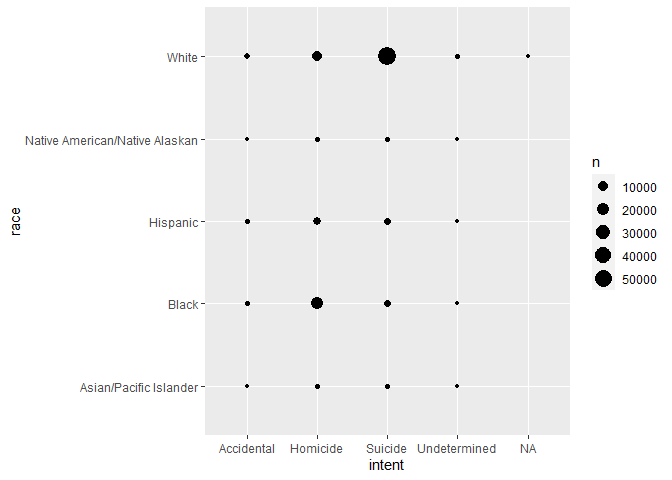
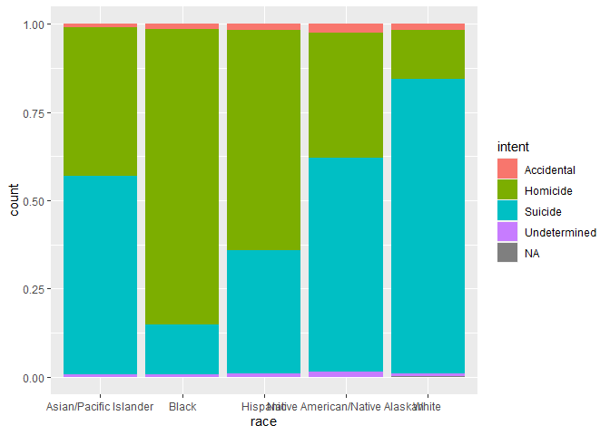
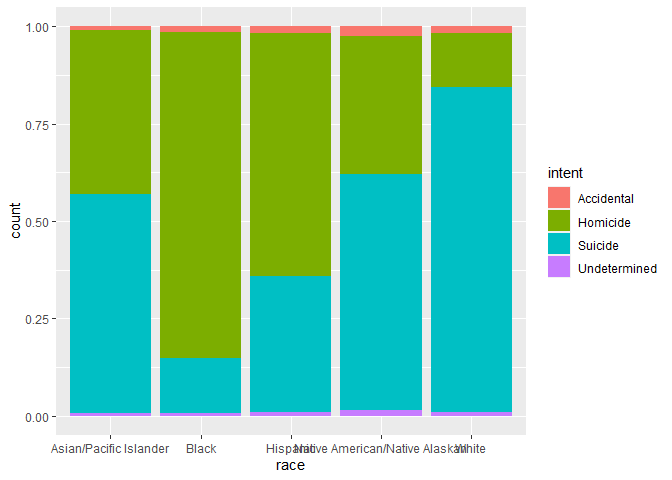
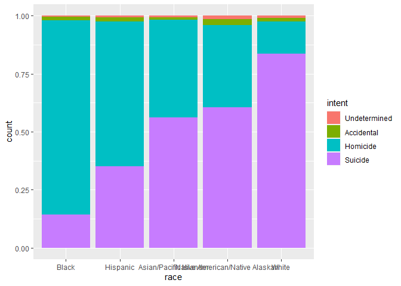
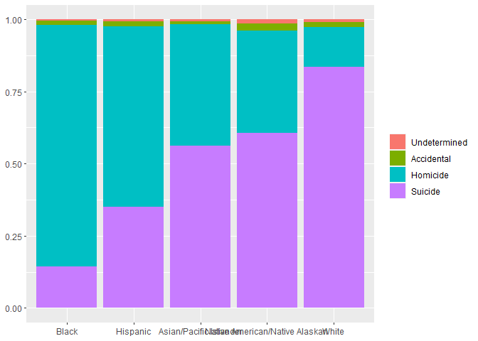
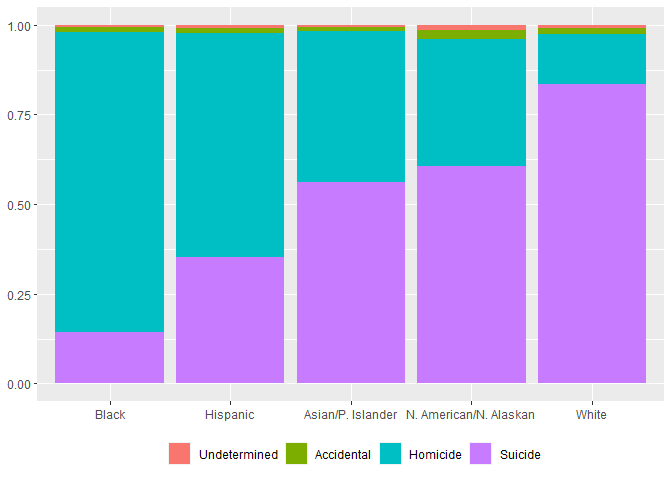
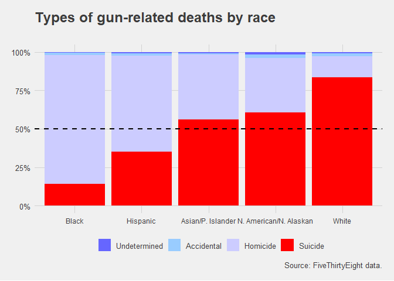

$~$

## 1. More resources for skills you will need. 

$~$

1. ***Basic R skills*** Check the Getting and transforming data in R section of the [syllabus](https://github.com/QMSS-G5063-2021/course_content). 
  - In particular, I strongly recommend mastering [section 5 of R for Data Science](https://r4ds.had.co.nz/transform.html) and the Data Camp introduction to R 
  - There is also an [unofficial solution manual written by Jeffrey Arnold](https://jrnold.github.io/r4ds-exercise-solutions/)
  - I also recommend downloading the slides from the course and also check [Yifei's TA repository](https://github.com/yifeitung/data_viz_review) (and his Github site in general, he has lots of insightful material there).
  
2. ***R Markdown skills *** Allows you to combine text and code and make your work reproducible. 
  - Some useful material are in this [course](https://rmarkdown.rstudio.com/lesson-1.html) by `R Studio`. The ***chunk section*** is incredibly useful. 
  - [R Makrdown cheat sheet](https://github.com/rstudio/cheatsheets/raw/master/rmarkdown-2.0.pdf) 
  - You can find more exhaustive material in  [2020 R Markdown Cookbook](https://bookdown.org/yihui/rmarkdown-cookbook/) and [RMarkdown for Scientists](https://rmd4sci.njtierney.com/)
  
3. ***GitHub*** Check the [syllabus](https://github.com/QMSS-G5063-2021/course_content). 
  - For starters, [try this guide](https://guides.github.com/activities/hello-world/)

 $~$


$~$

## 2. Some Basic R Markdown skills 

$~$

### 2.1 - Knit and Chunks.  

* ***Knit function***: This function takes an input file, extracts the R code in it according to a list of patterns, evaluates the code and writes the output in another file.   

* ***Chunks***: A code chunk is a runable piece of code. It can be an R code, but also a Python or STATA code (or others). 
    - Chunks have options. All the options are [here](https://yihui.org/knitr/options/). 
    - There is an option called cache, that allows you to run long codes faster when you have already run them once.  
    - Three remarkably useful options:
    
$~$
    
    
| Cunk option      | Use | 
|-------------|---------------|
| echo  |	Determines whether to display the source code in the output document. |
| warning  |	Determines whether to preserve warnings |
| message  |	Determines whether to preserve messages |
 

#### Your turn {.exercise} 
- Generate a blank R Markdown and save it somewhere. 
- knit the document
- Write `library(tidyverse)` on one of the chunks.
- knit the document while checking what happens when echo = T or echo = F. 
- Do the same for "warning" and "message" in the chunk that has library(tidyverse). 
- You have 3 minutes. 

$~$

### 2.2 - Shortcuts. 

A short-list of useful short-cuts to work more efficiently (from [`RMarkdown for Scientists`](https://rmd4sci.njtierney.com/)). 

| Action      | Windows/Linux | Mac  | 
|-------------|---------------|----------------|
| Show Keyboard Shortcut Reference  |	Alt+Shift+K | Option+Shift+K |
| Knit document | Ctrl + Shift + K | Cmd + Shift + K |
| Insert Chunk  | Ctrl + Alt + I   | Cmd + Option + I |
| Run Current Chunk | Ctrl + Alt + C | Cmd + Option + C | 
| Jump to  	Shift+Alt+J 	| Cmd+Shift+Option+J |
| Create multiple cursors | Ctrl + Alt + Up/Down | option + control + Up/Down|
| Delete the current line | Ctrl + D | Cmd + D|
| Un/Comment out a line   | Ctrl + Shift + C | Cmd + Shift + C| 
| Reformat Section | Ctrl + Shift + A | Cmd + Shift + A| 

#### Your turn {.exercise} 
- Using the Keyboard Shortcut Reference, find the keyboard shortcut for inserting a pipe character ( %>% )
- Generate a blank R Markdown and spend 3 minutes using these commands. 

$~$

## 3. Github  

$~$

You need to be able to do, at least, the following actions on Github: 

| Action  | 
|-------------|
| 1) Create and use a repository  |	
| 2) Clone and use and existing repository|	
| 3) Start and manage a new branch  |
| 4) Make changes to a file, and push them to GitHub as commits |	
| 5) Open and merge a pull request |	

I strongly encourge you to do the excercise that is in the Hello World. [Git-hub guide](https://guides.github.com/activities/hello-world/)

Here we are going to ***clone a repository*** and ***make changes to a file and push them**** to the main branch. 

***Cloning a repository*** is creating a local copy of an existing repository on your computer. 

***Commmitting a change *** After modifying a file in the cloned repository you can commit a change. You are saving a change *locally* into a ***branch*** (either the main branch or other), with a name and a description of what this change makes.  

***Pushing *** updates your commits in to the remote repository. You can only push the branch to GitHub if you have write access to the repository. Nevertheless, you can always create a branch in GitHub Desktop if you have read access to a repository


#### Your turn {.exercise} 
- Clone the sandbox in your computer
- Generate a folder with your UNI and an empty text file inside.  
- Commit the change on your GitHub client 
- Can you push that change into the remote repository? Why? 
- Push the change if you can. 

$~$

## 4. (Very) Basic R Skills 

$~$

A minimum list of commands and things you need to master *now*.  


<table class="table table-striped" style="margin-left: auto; margin-right: auto;">
 <thead>
  <tr>
   <th style="text-align:left;color: red !important;font-size: 18px;"> Commands </th>
   <th style="text-align:left;color: red !important;font-size: 18px;"> Description </th>
  </tr>
 </thead>
<tbody>
  <tr>
   <td style="text-align:left;"> Everything in the Introduction to R in Data Camp </td>
   <td style="text-align:left;"> Check the outline of the data camp course and do whatever you don't know </td>
  </tr>
  <tr>
   <td style="text-align:left;"> filter() </td>
   <td style="text-align:left;"> subset rows (observations) </td>
  </tr>
  <tr>
   <td style="text-align:left;"> select() </td>
   <td style="text-align:left;"> sorts rows </td>
  </tr>
  <tr>
   <td style="text-align:left;"> arrange() </td>
   <td style="text-align:left;"> keep or drop columns (observations, tip: use it as dplyr::select) </td>
  </tr>
  <tr>
   <td style="text-align:left;"> mutate() </td>
   <td style="text-align:left;"> generates a column </td>
  </tr>
  <tr>
   <td style="text-align:left;"> group_by() and summarise() </td>
   <td style="text-align:left;"> group_by() gives the instruction to operate within subsets, summarise() collapses the data by using a function </td>
  </tr>
  <tr>
   <td style="text-align:left;"> n() </td>
   <td style="text-align:left;"> counts </td>
  </tr>
  <tr>
   <td style="text-align:left;"> Everything about factors (Chapter 15) </td>
   <td style="text-align:left;"> categorical variables with a fix set of values </td>
  </tr>
</tbody>
</table>
$~$

## 5. R Skills: Data Exploration. 

$~$

Very quick review based on Exercise 2. Check the following table with commands. 


<table class="table table-striped" style="margin-left: auto; margin-right: auto;">
 <thead>
  <tr>
   <th style="text-align:left;color: red !important;font-size: 18px;"> Commands </th>
   <th style="text-align:left;color: red !important;font-size: 18px;"> Description </th>
  </tr>
 </thead>
<tbody>
  <tr>
   <td style="text-align:left;"> str() </td>
   <td style="text-align:left;"> Check the structure of the data </td>
  </tr>
  <tr>
   <td style="text-align:left;"> glimpse() </td>
   <td style="text-align:left;"> Check the structure of the data (dplyr) </td>
  </tr>
  <tr>
   <td style="text-align:left;"> head() </td>
   <td style="text-align:left;"> Check the first few rows </td>
  </tr>
  <tr>
   <td style="text-align:left;"> tail() </td>
   <td style="text-align:left;"> Check the last few rows </td>
  </tr>
  <tr>
   <td style="text-align:left;"> view() </td>
   <td style="text-align:left;"> View the data 1 </td>
  </tr>
  <tr>
   <td style="text-align:left;"> just run the name of the object </td>
   <td style="text-align:left;"> View the data 2 </td>
  </tr>
  <tr>
   <td style="text-align:left;"> names(), as.data.frame(names()) </td>
   <td style="text-align:left;"> Names of the variables </td>
  </tr>
  <tr>
   <td style="text-align:left;"> summary() </td>
   <td style="text-align:left;"> General description of all the variables*** </td>
  </tr>
  <tr>
   <td style="text-align:left;"> unique() </td>
   <td style="text-align:left;"> Dplyr command that can be used to check for duplicates (crucial for merging) </td>
  </tr>
  <tr>
   <td style="text-align:left;"> table() </td>
   <td style="text-align:left;"> Frequency table or two way table (use exclude = NULL for showing NA) </td>
  </tr>
</tbody>
</table>

### Let's try some of the ones that have not been used yet in class. 


```r
# Data-source 1: Gunsales - NYTimes
gun_sales <- analysis()
```

```
## [1] "Increase in monthly gun sales in Missouri = 8773.09"
```

```r
# Note that if we hadn't use message = F warning = F, the final output would have been messier.
```

### Quick summary of all the data - NOTE: IT ALSO COUNTS MISSNIG DATA!

Several times the data provided during the courses comes from clean and nice data-sets. Don't forget to check whether some of your data may have substantial problems like missing data or unwanted duplicates that will ruin your analysis and data-merging.   


```r
summary(gun_sales)
```

```
##       year          month          guns_total      guns_total_seas  
##  Min.   :2000   Min.   : 1.000   Min.   : 409742   Min.   : 573689  
##  1st Qu.:2004   1st Qu.: 3.000   1st Qu.: 610066   1st Qu.: 637499  
##  Median :2008   Median : 6.000   Median : 761089   Median : 748970  
##  Mean   :2008   Mean   : 6.448   Mean   : 838552   Mean   : 835160  
##  3rd Qu.:2012   3rd Qu.: 9.000   3rd Qu.: 987970   3rd Qu.:1053472  
##  Max.   :2016   Max.   :12.000   Max.   :2388128   Max.   :2015226  
##  guns_total_per_1000 guns_total_per_1000_scaled    handgun      
##  Min.   :1.985       Min.   :2.044              Min.   :148350  
##  1st Qu.:2.230       1st Qu.:2.271              1st Qu.:178376  
##  Median :2.477       Median :2.668              Median :237259  
##  Mean   :2.739       Mean   :2.975              Mean   :305079  
##  3rd Qu.:3.353       3rd Qu.:3.752              3rd Qu.:412394  
##  Max.   :6.393       Max.   :7.179              Max.   :886548  
##     longgun           other          multiple     longgun_share   
##  Min.   :356925   Min.   :    0   Min.   : 7421   Min.   :0.3379  
##  1st Qu.:377985   1st Qu.:    0   1st Qu.: 8464   1st Qu.:0.5471  
##  Median :400418   Median :    0   Median :14802   Median :0.6042  
##  Mean   :427909   Mean   : 6168   Mean   :14674   Mean   :0.5971  
##  3rd Qu.:455140   3rd Qu.: 8798   3rd Qu.:18652   3rd Qu.:0.6815  
##  Max.   :893224   Max.   :50889   Max.   :50669   Max.   :0.7034  
##  handgun_share      new_jersey        maryland         georgia     
##  Min.   :0.2899   Min.   :0.4150   Min.   :0.6370   Min.   :2.059  
##  1st Qu.:0.3115   1st Qu.:0.5190   1st Qu.:0.7518   1st Qu.:2.341  
##  Median :0.3805   Median :0.5915   Median :0.8425   Median :2.571  
##  Mean   :0.3871   Mean   :0.6081   Mean   :0.9179   Mean   :2.683  
##  3rd Qu.:0.4340   3rd Qu.:0.6760   3rd Qu.:1.0055   3rd Qu.:3.012  
##  Max.   :0.6187   Max.   :1.1320   Max.   :5.4100   Max.   :4.174  
##    louisiana      mississippi       missouri    
##  Min.   :1.849   Min.   :1.263   Min.   :2.437  
##  1st Qu.:2.276   1st Qu.:1.471   1st Qu.:2.737  
##  Median :2.397   Median :1.738   Median :3.191  
##  Mean   :2.418   Mean   :1.746   Mean   :3.124  
##  3rd Qu.:2.519   3rd Qu.:1.871   3rd Qu.:3.484  
##  Max.   :3.471   Max.   :2.480   Max.   :4.034  
##  dc_handguns_per_100k_national_sales
##  Min.   : 0.000                     
##  1st Qu.: 0.500                     
##  Median : 2.200                     
##  Mean   : 4.172                     
##  3rd Qu.: 7.950                     
##  Max.   :15.600
```

### Quick List of all the variables in the data-set

```r
names(gun_sales)
```

```
##  [1] "year"                                "month"                              
##  [3] "guns_total"                          "guns_total_seas"                    
##  [5] "guns_total_per_1000"                 "guns_total_per_1000_scaled"         
##  [7] "handgun"                             "longgun"                            
##  [9] "other"                               "multiple"                           
## [11] "longgun_share"                       "handgun_share"                      
## [13] "new_jersey"                          "maryland"                           
## [15] "georgia"                             "louisiana"                          
## [17] "mississippi"                         "missouri"                           
## [19] "dc_handguns_per_100k_national_sales"
```

```r
as.data.frame(names(gun_sales))
```

```
##                       names(gun_sales)
## 1                                 year
## 2                                month
## 3                           guns_total
## 4                      guns_total_seas
## 5                  guns_total_per_1000
## 6           guns_total_per_1000_scaled
## 7                              handgun
## 8                              longgun
## 9                                other
## 10                            multiple
## 11                       longgun_share
## 12                       handgun_share
## 13                          new_jersey
## 14                            maryland
## 15                             georgia
## 16                           louisiana
## 17                         mississippi
## 18                            missouri
## 19 dc_handguns_per_100k_national_sales
```

#### Your turn {.exercise} 
On your own: Try all these commands on the gun_sales data_set. 

$~$

## 6. ggplot 

$~$

Run the following code to download an individual data-set for gun-related deaths in the US 


```r
gun_inddeaths <- read_csv("https://raw.githubusercontent.com/fivethirtyeight/guns-data/master/full_data.csv")
```

```
## Warning: Missing column names filled in: 'X1' [1]
```

```
## Parsed with column specification:
## cols(
##   X1 = col_double(),
##   year = col_double(),
##   month = col_character(),
##   intent = col_character(),
##   police = col_double(),
##   sex = col_character(),
##   age = col_double(),
##   race = col_character(),
##   hispanic = col_double(),
##   place = col_character(),
##   education = col_character()
## )
```

```r
gun_inddeaths <- gun_inddeaths[,2:dim(gun_inddeaths)[2]]
```

Answer the following question: 

***What are the individual level patterns of gun deaths?***

$~$

### 6.1) What data do we have? 


```r
glimpse(gun_inddeaths) 
```

```
## Rows: 100,798
## Columns: 10
## $ year      <dbl> 2012, 2012, 2012, 2012, 2012, 2012, 2012, 2012, 2012, 201...
## $ month     <chr> "01", "01", "01", "02", "02", "02", "02", "03", "02", "02...
## $ intent    <chr> "Suicide", "Suicide", "Suicide", "Suicide", "Suicide", "S...
## $ police    <dbl> 0, 0, 0, 0, 0, 0, 0, 0, 0, 0, 0, 0, 0, 0, 0, 0, 0, 0, 0, ...
## $ sex       <chr> "M", "F", "M", "M", "M", "M", "M", "M", "M", "M", "M", "M...
## $ age       <dbl> 34, 21, 60, 64, 31, 17, 48, 41, 50, NA, 30, 21, 43, 34, 2...
## $ race      <chr> "Asian/Pacific Islander", "White", "White", "White", "Whi...
## $ hispanic  <dbl> 100, 100, 100, 100, 100, 100, 100, 100, 100, 998, 100, 10...
## $ place     <chr> "Home", "Street", "Other specified", "Home", "Other speci...
## $ education <chr> "BA+", "Some college", "BA+", "BA+", "HS/GED", "Less than...
```

Let's say we are interested in exploring the relationship between race and intent. We can have a closer look to both variables.  


```r
ftable(gun_inddeaths$intent, exclude = NULL) # One missing value 
```

```
##  Accidental Homicide Suicide Undetermined    NA
##                                                
##        1639    35176   63175          807     1
```

```r
ftable(gun_inddeaths$race, exclude = NULL)  # No missing values
```

```
##  Asian/Pacific Islander Black Hispanic Native American/Native Alaskan White
##                                                                            
##                    1326 23296     9022                            917 66237
```

```r
table(gun_inddeaths$race, gun_inddeaths$intent , exclude = NULL)  
```

```
##                                 
##                                  Accidental Homicide Suicide Undetermined  <NA>
##   Asian/Pacific Islander                 12      559     745           10     0
##   Black                                 328    19510    3332          126     0
##   Hispanic                              145     5634    3171           72     0
##   Native American/Native Alaskan         22      326     555           14     0
##   White                                1132     9147   55372          585     1
```

$~$

### 6.2) What are the ggplot alternatives available?  

Looks like a very open question. What is the more suitable geom available in `ggplot2`? 

Let's look at the [ggplot cheat sheet](https://rstudio.com/wp-content/uploads/2016/11/ggplot2-cheatsheet-2.1.pdf)   


Another way to check for the alternatives available is by visiting graph galleries. 

- Look to the ggplot section of the [R graph gallery](https://www.r-graph-gallery.com/ggplot2-package.html)
- Or [these top 50 ggplot](http://r-statistics.co/Top50-Ggplot2-Visualizations-MasterList-R-Code.html) visualizations bySelva Prabhakaran

Graph galleries also have codes that you can easily adapt to your purposes. 

$~$

### 6.3) Ok, we want to do a geom_count

From the ggplot cheat sheet we know that geom_count is an alternative to visualize two discrete variables. Let's try it: 


```r
ggplot(gun_inddeaths, aes(intent, race)) + 
  geom_count()
```

<!-- -->

It looks difficult to compare, specially because of the frequencies in each race.... 

What about the bar_plots from class with `fill` position. 


```r
ggplot(gun_inddeaths) + 
  geom_bar(aes(x = race, fill = intent), position = "fill") 
```

<!-- -->

It looks, much better: easier to compare between races. 

#### We found a pattern we want to emphasize: {.exercise2} 
Blacks and Hispanics are less likely to die because of a suicide compare to the rest of the gun related-deaths. 

#### Let's list all the reasons why it still is different get the information we want from it:   
 
- There is NA category for missing values has very few values. (How do we know?)
- Helping the audience: 
  * Race ordering is alphabetical. We are not "making it easier for the audience" to compare between races.  
  * Intent ordering is alphabetical. We are not "making it easier for the audience" to compare between intents.  
- The legend "Intent", the title "race" and the title "count" seems unnecessary. 
- The labels in the bottom are unreadable
- Suicides and "less likely" are not emphasized compared to the other types of intents. 
- Can we make some tweaks to make the visualization more: "1) Trustful 2) Functional 3) Beautiful 4) Insightful"?

#### 

$~$

Let's fix all of this:

### 6.4) There is NA category for missing values has very few values.


```r
# How many NA?
ftable(gun_inddeaths$intent, exclude = NULL) # Only one!
```

```
##  Accidental Homicide Suicide Undetermined    NA
##                                                
##        1639    35176   63175          807     1
```

```r
ftable(gun_inddeaths$race, exclude = NULL)
```

```
##  Asian/Pacific Islander Black Hispanic Native American/Native Alaskan White
##                                                                            
##                    1326 23296     9022                            917 66237
```

```r
# Let's fix this: 
ggplot(gun_inddeaths %>% drop_na(intent)) +  # We drop the only NA in intent 
  geom_bar(aes(x = race, fill = intent), position = "fill") 
```

<!-- -->

$~$

### 6.5) Ordering: "Ordering improves visual perception"  

How can we work with discrete variables?: With factors.  


```r
gun_inddeaths$race <- factor(gun_inddeaths$race, levels = c("Black", "Hispanic", "Asian/Pacific Islander", "Native American/Native Alaskan", "White"))
gun_inddeaths$intent <- factor(gun_inddeaths$intent, levels = c("Undetermined", "Accidental", "Homicide", "Suicide"))

ggplot(gun_inddeaths %>% drop_na(intent)) +  # We drop the only NA in intent 
  geom_bar(aes(x = race, fill = intent), position = "fill") 
```

<!-- -->
$~$

### 6.6) Drop redundant info (and now ilegible)


```r
ggplot(gun_inddeaths %>% drop_na(intent)) +  # We drop the only NA in intent 
  geom_bar(aes(x = factor(race, levels = c("Black", "Hispanic", "Asian/Pacific Islander", "Native American/Native Alaskan", "White")), fill = intent), position = "fill") + 
  xlab(NULL) + ylab(NULL) + theme(legend.title = element_blank())
```

<!-- -->
$~$

### 6.7) The labels in the bottom are unreadable

* What if:
  - We shorten the labels. 
  - We move the legend to the bottom 


```r
levels(gun_inddeaths$race)[levels(gun_inddeaths$race)=="Asian/Pacific Islander"] <- "Asian/P. Islander"
levels(gun_inddeaths$race)[levels(gun_inddeaths$race)=="Native American/Native Alaskan"] <- "N. American/N. Alaskan"

ggplot(gun_inddeaths %>% drop_na(intent)) +  # We drop the only NA in intent 
  geom_bar(aes(x = factor(race, levels = c("Black", "Hispanic", "Asian/P. Islander", "N. American/N. Alaskan", "White")), fill = intent), position = "fill") + 
  xlab(NULL) + ylab(NULL) + theme(legend.title = element_blank()) +  theme(axis.text.x = element_text(size = 9)) +   theme(legend.title = element_blank(), legend.position =  "bottom")
```

<!-- -->

$~$

### 6.8) Suicides and "less likely" are not emphasized compared to the of types of deaths. 

- Let's emphasize suicides by making a relative difference with the others types of deaths. 
  * Note that suicide is already emphasized in how we ordered the type of deaths. 
  * We want to use an additional channel to emphasize the information. 

- Let's emphasize "less" likely using an horizontal line at 50%. 

Beautiful? 

- Let's use a theme from ggthemes (look for this theme gallery [here](https://yutannihilation.github.io/allYourFigureAreBelongToUs/ggthemes/))

Functional?

- It's not that clear that the y axis label is percentages. Let's fix this.  


```r
levels(gun_inddeaths$race)[levels(gun_inddeaths$race)=="Asian/Pacific Islander"] <- "Asian/P. Islander"
levels(gun_inddeaths$race)[levels(gun_inddeaths$race)=="Native American/Native Alaskan"] <- "N. American/N. Alaskan"

ggplot(gun_inddeaths %>% drop_na(intent)) +  # We drop the only NA in intent 
  geom_bar(aes(x = factor(race, levels = c("Black", "Hispanic", "Asian/P. Islander", "N. American/N. Alaskan", "White")), fill = intent), position = "fill") + 
  theme(legend.title = element_blank()) + 
  theme(axis.text.x = element_text(angle = 45, vjust = 0.9, hjust=1)) + 
  geom_hline(yintercept=0.5, linetype="dashed", color = "black", size = 1) +  
  labs(x = NULL, y = NULL, 
       title = "Types of gun-related deaths by race \n", caption = "Source: FiveThirtyEight data.") + 
  scale_fill_manual("", values = c("#6666FF", "#99CCFF", "#CCCCFF", "red")) + theme_fivethirtyeight() + scale_y_continuous(labels = dollar_format(suffix = "%", prefix = "")) + scale_y_continuous(labels=percent_format()) + theme(axis.text.x = element_text(size = 9))
```

<!-- -->

