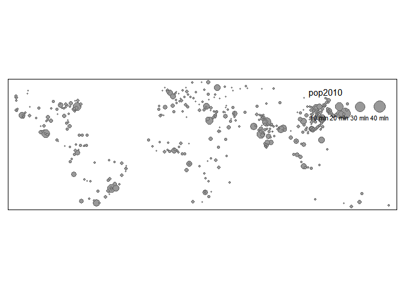
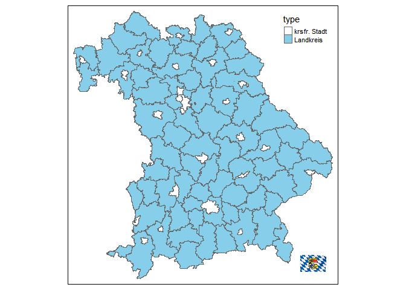
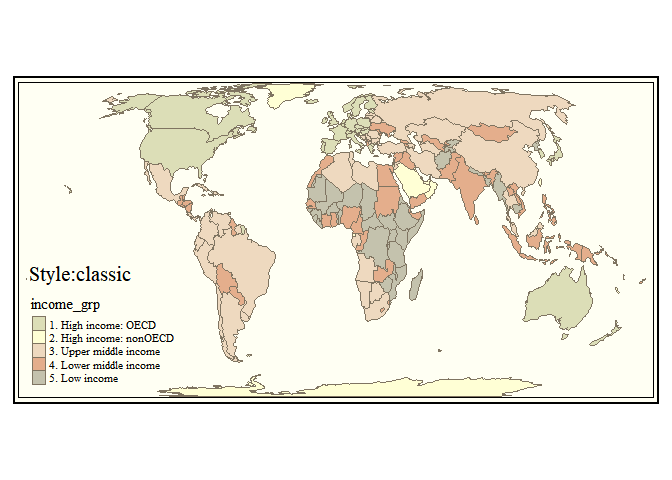

$~$

## 0 - Resources 

***Warning***: For this TA section the references are particularly important, since the codes and examples of tmap are migrating to SF objects. The resources here gives you some places to look at to learn more from SF, although the general guidelines are here. Some commands in the slides were using sf objects like geom_sf(), but in this section there are some more references that can be helpful to do spatial data-wrangling among others.   

$~$

* [Introduction to Spatial Data Types with R](https://cengel.github.io/rspatial/2_spDataTypes.nb.html) by Claudia Engel describes the different types of spatial data types in R. 
* [Introduction to GIS with R](https://www.jessesadler.com/post/gis-with-r-intro/) by Jesse Sadler describes the SP and SF package. 
* [A brief introduction to the tmap package](https://tlorusso.github.io/geodata_workshop/tmap_package) by Thomas Lo Russo & Max Grütter is a reference that was included in the slides from the course. 
* (***Highly recommended***)[tmap: Thematic maps in R](https://www.jstatsoft.org/index.php/jss/article/view/v084i06/v84i06.pdf) by Martijn Tennekes, Journal of Statistical Software paper that lists all the features of tmap. 
* [Creating maps with tmap](http://rstudio-pubs-static.s3.amazonaws.com/229482_b5b182f650434a36ace4eeef2d2bcd83.html#1) by Chris Bundson a short reference to tmap from Rstudio
* (***Highly recommended***) [Geocomputation with R](https://geocompr.robinlovelace.net/) by Robin Lovelace, Jakub Nowosad, Jannes Muenchow. A book on geographic data analysis, visualization and modeling. Is different from the other resources because it also provides detailed explanation about each of the different spatial operations (subsetting, spatial relationships, spatial joining, aggrergation, distance relationships.) Also, provides a comprehensive discussion of the `sf`type objects. 
* [Making Maps with R](https://bookdown.org/nicohahn/making_maps_with_r5/docs/introduction.html) by Nico Hahn. Include tmap animations and an overview of different ways to draw maps in R.   

This TASection draws intensively from [tmap: Thematic maps in R](https://www.jstatsoft.org/index.php/jss/article/view/v084i06/v84i06.pdf) by Martijn Tennekes

#### On your own {.exercise}  
* Go to the website of [Geocomputation with R](https://geocompr.robinlovelace.net/) and read the vector attribute manipulation section. 

$~$

## 1 - Summary: Spatial Data Types and sf objects   

$~$


<style type="text/css">
caption {
      color: black;
      font-weight: bold;
      align-items: center;
      font-size: 1.3em;
    }
</style>

<table class="table table-striped" style="margin-left: auto; margin-right: auto;">
<caption><b>Table 1 - types of data sets with geographic information outside R<b></b></b></caption>
 <thead>
  <tr>
   <th style="text-align:left;color: red !important;font-size: 18px;"> Types of data sets </th>
   <th style="text-align:left;color: red !important;font-size: 18px;"> Description </th>
  </tr>
 </thead>
<tbody>
  <tr>
   <td style="text-align:left;"> Latitude and Longitude coordinates </td>
   <td style="text-align:left;"> Pair of coordinates. The most basic data. Can come in any file that supports a pair of numbers. </td>
  </tr>
  <tr>
   <td style="text-align:left;"> Shape files </td>
   <td style="text-align:left;"> Vector data: Include points, lines and polygon. The data necessairly comes in at least 3 files (.shp, .shx, .dbf extension and others). </td>
  </tr>
  <tr>
   <td style="text-align:left;"> Raster data </td>
   <td style="text-align:left;"> Raster data: the surface is represented as a grid of cells. </td>
  </tr>
</tbody>
</table>

<table class="table table-striped" style="margin-left: auto; margin-right: auto;">
<caption><b>Table 2 - R spatial objects<b></b></b></caption>
 <thead>
  <tr>
   <th style="text-align:left;color: red !important;font-size: 18px;"> Object </th>
   <th style="text-align:left;color: red !important;font-size: 18px;"> Description </th>
   <th style="text-align:left;color: red !important;font-size: 18px;"> Observations </th>
  </tr>
 </thead>
<tbody>
  <tr>
   <td style="text-align:left;"> sp  objects (vector data) </td>
   <td style="text-align:left;"> The object has various slots that can be read with `@` and can include non spatial data. It stored under a SpatialPolygonsDataFrame class. </td>
   <td style="text-align:left;"> A shape files is turned into this sp object when using readOGR.  Non compatible with tidyverse, which is why we subset with [] instead of dplyr verbs like filter. </td>
  </tr>
  <tr>
   <td style="text-align:left;"> sf objects (vector data) </td>
   <td style="text-align:left;"> The object is a data frame with a column that has sfc class data that contains the geografic information. </td>
   <td style="text-align:left;"> Compatible with tidyverse including ggplot (ie. geom_sf()). Shape files can also be read but using `st_read` from the sf package.). Can be manipulated using dplyr verbs, can be faster to load, and can be dealt with the st_ family functions which are relatively consistent and intuitive. SF format was not exhaustively covered in class but appears in some slides. </td>
  </tr>
  <tr>
   <td style="text-align:left;"> sp  objects (raster data) </td>
   <td style="text-align:left;"> The object has various slots that can be read with `@` and can include non spatial data.  It is stored under a SpatialGrid, SpatialPixels,SpatialGridDataFrame or SpatialPixelsDataFrame class. </td>
   <td style="text-align:left;">  </td>
  </tr>
  <tr>
   <td style="text-align:left;"> RasterLayer object (raster data) </td>
   <td style="text-align:left;"> raster data stored under a RasterLayer class </td>
   <td style="text-align:left;"> can be manipulated with the raster package which provides nicer features than dealing with raster data with the sp package </td>
  </tr>
</tbody>
</table>

#### ***An example of an SF object***  

The Tigris package allows to obtain sf polygons of census tracts and others from the US Census Bureau. Let's open an sf object. 


```r
# We import the data. 
tracts2010 <- tracts("FLORIDA", year = 2010)
```


```r
# We check: it's SF
class(tracts2010)
```

```
## [1] "sf"         "data.frame"
```

***Since it's an sf object, it's a data frame  with a geometric column. Find the column with spatial geometries.***  


```r
glimpse(tracts2010)
```

```
## Rows: 4,245
## Columns: 15
## $ STATEFP10  <chr> "12", "12", "12", "12", "12", "12", "12", "12", "12", "1...
## $ COUNTYFP10 <chr> "009", "009", "009", "009", "009", "009", "009", "009", ...
## $ TRACTCE10  <chr> "068300", "068400", "068601", "068502", "068602", "98000...
## $ GEOID10    <chr> "12009068300", "12009068400", "12009068601", "1200906850...
## $ NAME10     <chr> "683", "684", "686.01", "685.02", "686.02", "9800", "713...
## $ NAMELSAD10 <chr> "Census Tract 683", "Census Tract 684", "Census Tract 68...
## $ MTFCC10    <chr> "G5020", "G5020", "G5020", "G5020", "G5020", "G5020", "G...
## $ FUNCSTAT10 <chr> "S", "S", "S", "S", "S", "S", "S", "S", "S", "S", "S", "...
## $ ALAND10    <dbl> 1886507, 1699567, 2981908, 1021413, 3243209, 65110387, 5...
## $ AWATER10   <dbl> 1893264, 6242872, 4187210, 549457, 1436745, 16731834, 45...
## $ INTPTLAT10 <chr> "+28.3410296", "+28.3579064", "+28.4044135", "+28.386084...
## $ INTPTLON10 <chr> "-080.6080301", "-080.6330330", "-080.6306937", "-080.59...
## $ geometry   <MULTIPOLYGON [°]> MULTIPOLYGON (((-80.60549 2..., MULTIPOLYGO...
## $ COUNTYFP   <chr> "009", "009", "009", "009", "009", "009", "009", "009", ...
## $ STATEFP    <chr> "12", "12", "12", "12", "12", "12", "12", "12", "12", "1...
```

How many census tracts?


```r
nrow(tracts2010)
```

```
## [1] 4245
```

#### On your own {.exercise}  
* Use the command `data("World", "land", "rivers", package = "tmap")`
* Then, use `class` to get the class of each of these objects
* Find the `sf` objects, open the data frame and identify the column that has the geometry. 
* Is any of the type of objects not included in table 1 and 2?
* Use $ to check the variables available inside sf objects. 

$~$

## 2 - Spatial data-wrangling  

$~$

Everything here is taken from  [Geocomputation with R](https://geocompr.robinlovelace.net/) by Robin Lovelace, Jakub Nowosad, Jannes Muenchow. This book is highy recommned by some other of the references above. 

Following this reference, we can decompose spatial data-wrangling (without considering raster data) into 3 types of operations. 

* ***Attribute operations***: operations that affect data is non-spatial information associated with geographic information. 

* ***Spatial operations***: operations that modify spatial objects in a multitude of ways based on their location and shape.

* ***Geometric operations***: operations that in some way change the geometry of vector (sf)

Warning: only with vectorized data. I'm not including raster data.  Check the reference.   


```r
table3 <- read_xlsx("data/table.xlsx")
kable(table3, caption = "<b>Table 3 - Spatial Data Wrangling Operations<b>") %>% 
  kable_styling("striped") %>% 
  row_spec(0, color = "red", font_size = 18) %>%
  pack_rows("Attribute operations", 1, 4, label_row_css = "background-color: #666; color: #fff;") %>% 
  pack_rows("Spatial operations", 5, 13, label_row_css = "background-color: #666; color: #fff;") %>%   
  pack_rows("Geometric operations", 14, 18, label_row_css = "background-color: #666; color: #fff;")  
```

<table class="table table-striped" style="margin-left: auto; margin-right: auto;">
<caption><b>Table 3 - Spatial Data Wrangling Operations<b></b></b></caption>
 <thead>
  <tr>
   <th style="text-align:left;color: red !important;font-size: 18px;"> Operation </th>
   <th style="text-align:left;color: red !important;font-size: 18px;"> Command(s) </th>
   <th style="text-align:left;color: red !important;font-size: 18px;"> Description </th>
   <th style="text-align:left;color: red !important;font-size: 18px;"> Examples </th>
  </tr>
 </thead>
<tbody>
  <tr grouplength="4"><td colspan="4" style="background-color: #666; color: #fff;"><strong>Attribute operations</strong></td></tr>
<tr>
   <td style="text-align:left;padding-left: 2em;" indentlevel="1"> Subetting </td>
   <td style="text-align:left;"> Base R: [ ], subset()  or Dplyr: filter </td>
   <td style="text-align:left;"> Extract one piece of the shapefile </td>
   <td style="text-align:left;"> world[1:6, ]  ;  world %&gt;%
  filter(continent == "Asia") </td>
  </tr>
  <tr>
   <td style="text-align:left;padding-left: 2em;" indentlevel="1"> Aggregation </td>
   <td style="text-align:left;"> base R: aggregate. Dplyr: group_by() %&gt;% summarize() </td>
   <td style="text-align:left;"> Aggregates data, at a group level. Typically an attribute. </td>
   <td style="text-align:left;"> world %&gt;%
  group_by(continent) %&gt;%
  summarize(pop = sum(pop, na.rm = TRUE)) </td>
  </tr>
  <tr>
   <td style="text-align:left;padding-left: 2em;" indentlevel="1"> Vector attribute joining </td>
   <td style="text-align:left;"> base R: merge(), dplyr:: inner_join() , left_join() etc </td>
   <td style="text-align:left;"> Adds attributes </td>
   <td style="text-align:left;"> left_join(world, coffee_renamed, by = c(name_long = "nm")) </td>
  </tr>
  <tr>
   <td style="text-align:left;padding-left: 2em;" indentlevel="1"> Creating attributes </td>
   <td style="text-align:left;"> dplyr: mutate </td>
   <td style="text-align:left;"> Creates an attribute </td>
   <td style="text-align:left;"> world %&gt;% 
  mutate(pop_dens = pop / area_km2) </td>
  </tr>
  <tr grouplength="9"><td colspan="4" style="background-color: #666; color: #fff;"><strong>Spatial operations</strong></td></tr>
<tr>
   <td style="text-align:left;padding-left: 2em;" indentlevel="1"> Spatial subsetting </td>
   <td style="text-align:left;"> [ ] </td>
   <td style="text-align:left;"> The process of selecting features of a spatial object based on whether or not they in some way relate in space to another object </td>
   <td style="text-align:left;"> (Data preparation, generates the canterbury object) canterbury = nz %&gt;% filter(Name == "Canterbury")
(subsetting, leaving only the points that are in canterbury) canterbury_height = nz_height[canterbury, ] </td>
  </tr>
  <tr>
   <td style="text-align:left;padding-left: 2em;" indentlevel="1"> Intersection </td>
   <td style="text-align:left;"> st_intersects() </td>
   <td style="text-align:left;"> Which of the points in p intersect in some way with polygon a </td>
   <td style="text-align:left;"> st_intersects(p, a) </td>
  </tr>
  <tr>
   <td style="text-align:left;padding-left: 2em;" indentlevel="1"> Disjoin </td>
   <td style="text-align:left;"> st_disjoint() </td>
   <td style="text-align:left;"> The opposite of intersect </td>
   <td style="text-align:left;"> st_disjoint(p, a, sparse = FALSE)[, 1] ([,1] converts the result into a vector) </td>
  </tr>
  <tr>
   <td style="text-align:left;padding-left: 2em;" indentlevel="1"> Finding objects inside a polygone </td>
   <td style="text-align:left;"> st_within() </td>
   <td style="text-align:left;"> returns TRUE only for objects that are completely within the selecting object. </td>
   <td style="text-align:left;"> st_within(p, a, sparse = FALSE)[, 1] </td>
  </tr>
  <tr>
   <td style="text-align:left;padding-left: 2em;" indentlevel="1"> Finding an object that touches the polygone </td>
   <td style="text-align:left;"> st_touches() </td>
   <td style="text-align:left;"> returns TRUE only for objects that touchers the borders of the polygon </td>
   <td style="text-align:left;"> st_touches(p, a, sparse = FALSE)[, 1] </td>
  </tr>
  <tr>
   <td style="text-align:left;padding-left: 2em;" indentlevel="1"> Finding an object that almost touches the polygon </td>
   <td style="text-align:left;"> st_touches(p, a, sparse = FALSE)[, 1] </td>
   <td style="text-align:left;"> returns TRUE only for objects that almost touchers the borders of the polygon within a distance </td>
   <td style="text-align:left;"> st_is_within_distance(p, a, dist = 0.9) </td>
  </tr>
  <tr>
   <td style="text-align:left;padding-left: 2em;" indentlevel="1"> Spatial joining </td>
   <td style="text-align:left;"> st_join() </td>
   <td style="text-align:left;"> The process can be illustrated by an example. Imagine you have ten points randomly distributed across the Earth’s surface. Of the points that are on land, which countries are they in? </td>
   <td style="text-align:left;"> random_joined = st_join(random_points, world["name_long"]) [See book for more details] </td>
  </tr>
  <tr>
   <td style="text-align:left;padding-left: 2em;" indentlevel="1"> Non-overlapping joins </td>
   <td style="text-align:left;"> st_join() </td>
   <td style="text-align:left;"> st_join(), but with an addition dist </td>
   <td style="text-align:left;"> NA </td>
  </tr>
  <tr>
   <td style="text-align:left;padding-left: 2em;" indentlevel="1"> Spatial data aggregation </td>
   <td style="text-align:left;"> base R: aggregate. Dplyr: group_by() %&gt;% summarize() </td>
   <td style="text-align:left;"> Aggregates data, at a group level. The group level is a geographic feature, for example contigous polygons </td>
   <td style="text-align:left;"> us_states %&gt;% group_by(REGION) %&gt;%
  summarize(pop = sum(total_pop_15, na.rm = TRUE)) </td>
  </tr>
  <tr grouplength="5"><td colspan="4" style="background-color: #666; color: #fff;"><strong>Geometric operations</strong></td></tr>
<tr>
   <td style="text-align:left;padding-left: 2em;" indentlevel="1"> Simplification </td>
   <td style="text-align:left;"> st_simplify() </td>
   <td style="text-align:left;"> A process for generalization of vector objects (lines and polygons) usually for use in smaller scale maps. Another reason for simplifying objects is to reduce the amount of memory, disk space and network bandwidth they consume </td>
   <td style="text-align:left;"> us_states_simp1 = st_simplify(us_states2163, dTolerance = 100000) </td>
  </tr>
  <tr>
   <td style="text-align:left;padding-left: 2em;" indentlevel="1"> Centroids </td>
   <td style="text-align:left;"> st_centroid() </td>
   <td style="text-align:left;"> Calculates the centroids of ploygons </td>
   <td style="text-align:left;"> st_centroid(nz) </td>
  </tr>
  <tr>
   <td style="text-align:left;padding-left: 2em;" indentlevel="1"> Buffers </td>
   <td style="text-align:left;"> st_buffer() </td>
   <td style="text-align:left;"> Buffers are polygons representing the area within a given distance of a geometric feature: regardless of whether the input is a point, line or polygon, the output is a polygon. </td>
   <td style="text-align:left;"> st_buffer(seine, dist = 5000) </td>
  </tr>
  <tr>
   <td style="text-align:left;padding-left: 2em;" indentlevel="1"> Affine transformations </td>
   <td style="text-align:left;"> NA </td>
   <td style="text-align:left;"> Affine transformation is any transformation that preserves lines and parallelism. </td>
   <td style="text-align:left;"> NA </td>
  </tr>
  <tr>
   <td style="text-align:left;padding-left: 2em;" indentlevel="1"> Geometry unions </td>
   <td style="text-align:left;"> st_union() </td>
   <td style="text-align:left;"> Aggregates shapefiles into a larger shapefile. </td>
   <td style="text-align:left;"> (subsets all the shape files that follow a certain condition) us_west = us_states[us_states$REGION == "West", ]
(Generates a new shape file that joins the shapefiles in that area) us_west_union = st_union(us_west) </td>
  </tr>
  <tr>
   <td style="text-align:left;"> Type transformation </td>
   <td style="text-align:left;"> st_cast() </td>
   <td style="text-align:left;"> Transform points into lines, or lines into polygons, etc </td>
   <td style="text-align:left;"> multipoint_2 = st_cast(linestring, "MULTIPOINT") </td>
  </tr>
</tbody>
</table>


You can also check more of the possibilites with sf objects using this command: 


```r
methods(class="sf")
```

```
##  [1] $<-                   [                     [[<-                 
##  [4] aggregate             anti_join             arrange              
##  [7] as.data.frame         cbind                 coerce               
## [10] dbDataType            dbWriteTable          distinct             
## [13] dplyr_reconstruct     filter                full_join            
## [16] gather                group_by              group_split          
## [19] identify              initialize            inner_join           
## [22] left_join             merge                 mutate               
## [25] nest                  plot                  print                
## [28] rbind                 rename                right_join           
## [31] rowwise               sample_frac           sample_n             
## [34] select                semi_join             separate             
## [37] separate_rows         show                  slice                
## [40] slotsFromS3           spread                st_agr               
## [43] st_agr<-              st_area               st_as_s2             
## [46] st_as_sf              st_bbox               st_boundary          
## [49] st_buffer             st_cast               st_centroid          
## [52] st_collection_extract st_convex_hull        st_coordinates       
## [55] st_crop               st_crs                st_crs<-             
## [58] st_difference         st_filter             st_geometry          
## [61] st_geometry<-         st_interpolate_aw     st_intersection      
## [64] st_intersects         st_is                 st_is_valid          
## [67] st_join               st_line_merge         st_m_range           
## [70] st_make_valid         st_nearest_points     st_node              
## [73] st_normalize          st_point_on_surface   st_polygonize        
## [76] st_precision          st_reverse            st_sample            
## [79] st_segmentize         st_set_precision      st_shift_longitude   
## [82] st_simplify           st_snap               st_sym_difference    
## [85] st_transform          st_triangulate        st_union             
## [88] st_voronoi            st_wrap_dateline      st_write             
## [91] st_z_range            st_zm                 summarise            
## [94] transform             transmute             ungroup              
## [97] unite                 unnest               
## see '?methods' for accessing help and source code
```


#### ***Example of Spatial data Wrangling using st_ commands*** 

In this example, we will geolocate (the centroid) Dowtown Miami and then find all the census tracts that are within a certain distance of this location. The final result is a subset of all the census tracts from Florida. 

Let's first map all Florida's census tract without any subsetting. 


```r
# tracts2010 <- tracts("FLORIDA", year = 2010) We already did this above! 
tm_shape(tracts2010) + 
  tm_borders()
```

<!-- -->

Now, let's get the coordinates from Downtown miami, and find all the poluyones  that are within a certain distance from that point. 


```r
# With googleway: 
# -------------- # 
# ob <- google_geocode(address = "Downtown Miami, Miami, FL", simplify = TRUE) # We geocode downtown Miami
# miami_location <- (ob$results$geometry$location) # We substract the coordinates using googleway
# miami_location_point <- st_point(x = c(miami_location[1,2], miami_location[1,1])) # We convert the point into a geometric object

# Since you need a Google Key I will put the coordinates c(-80.19187, 25.77125) directly.

# First, we transform the coordinates into a geometric object
miami_location_point <- st_point(x =  c(-80.19187, 25.77125)) 

# We tranform the geometric object into a sfc object, sfc ojects are sf spatial ojects that have a projcetion ("CRS"). 
# We choose as a projection the same from the census tract. 
projection_census <- st_crs(tracts2010)$input
miami_location_crs <- st_sfc(miami_location_point, crs = projection_census) 

# We do the spatial merge. It will return an sgbp objetct that is a list that has all the intersections within 10000 distance units.    
around_miami <- st_is_within_distance(tracts2010, miami_location_crs, dist = 10000) 

# We transform the sgbp object into a matric with TRUE and FALSE for each of the census tract.  
sel_logical <-  lengths(around_miami) > 0 # We look for the intersections 

# We finally subset all the tracts to only the ones that are near Miami. 
tracts2010_around_miami <- tracts2010[sel_logical, ] # We subset the intersections from the census tract. 
```

Now, let's map the final result. Voila!: 


```r
# We map. 
tm_shape(tracts2010_around_miami) + 
  tm_borders()
```

<!-- -->


$~$

## 3 - tmap: Thematic maps in R  

$~$

### 3.1 - Why tmap? 

* Flexible, layer-based, and easy to use approach to create maps

* Syntax based on "layered grammar of graphics" which is similar to that of ggplot2.

* Can manipulate sf, sp, and raster objects. 

* Has a companion package "tmaptools" that contains convinient functions to read and process spatial data. 

### 3.2 - tmap syntax

* Tmap syntax is based on element functions whose names have the prefix tm_ and that are stacked with the + operator, in the same way as in ggplot.  

* The tmap syntax can be decomposed into 5 aspects: 

1) Shape 

2) Layers

3) Small multiples 

4) Map Attributes

5) Layout


#### 3.2.1 - Shape  

* The most fundamental element function is tm_shape. But you can't draw a plot by using only tm_shape.

* One of the important arguments of the tm_shape function is the projection.

Example:


```r
# Here we are opneing the World option with the 4326 projection.
tm_shape(World, projection=4326)

# Here we are opneing the World option with the +proj=robin projection.
tm_shape(World, projection="+proj=robin")


# Rmarkdown note for this chunk: I used the eval = F option to include a a code that is not run but it's shown. This can be used to store pieces of code you don't want to run into a chunk.
```
 
#### On your own {.exercise}  
* Open the world data-set from tm map using `data("World", "land", "rivers", package = "tmap")` 
* Try to run a chunk with only tm_shape 
 
#### 3.2.2 - Layers  

* tm_shape should always be followed by one or more layers:

   - tm_polygons

   - tm_symbols

   - tm_lines

   - tm_raster 

   - tm_text

   - tm_fill

   - tm_borders

   - tm_bubbles

   - tm_squares

   - tm_dots
   
   - tm_rgb  

   - tm_markers
   
* Each of these layers have some aesthetics (color, size, shape, text labels etc...) that can be found using help, or online documentation. 

#### Examples: 


```r
# We will use the World, land rivers from the tmap data-set. 
data("World", "land", "rivers", "metro",  package = "tmap")
```

#### Only fill 

```r
tm_shape(World) + tm_fill() 
```

<!-- -->

#### Only borders 

```r
tm_shape(World) + tm_borders() 
```

<!-- -->

#### Only polygons 

```r
tm_shape(World) + tm_polygons() 
```

<!-- -->

#### Only polygons: changing color the aesthetic 

```r
tm_shape(World) + tm_polygons(col = "income_grp") 
```

<!-- -->

#### Only text

```r
tm_shape(World) + tm_text(text = "iso_a3")
```

<!-- -->

#### Only text: changing the size aesthetic

```r
tm_shape(World) + tm_text(text = "iso_a3", size = "AREA")
```

<!-- -->

#### Only bubbles

```r
# Note that this is a different shape files. 
tm_shape(metro) +  tm_bubbles()
```

<!-- -->

#### Only bubbles: changing the size aesthetic

```r
# Note: What type of object is metro? Then, how can you open it: using $ or @
tm_shape(metro) +  tm_bubbles(size = "pop2010")
```

<!-- -->

#### Everything together:

* Does the aesthetics look good? (ie. polygon colors)

* Why could this be a  problem? (Remember week02)

* What do we do with this? (What tool did the professor mention to choose map colors?) 


```r
# Note: You can combine many shape-files in the same plot. 
tm_shape(World) + tm_polygons(col = "income_grp") + 
tm_text(text = "iso_a3", size = "AREA") +
tm_shape(metro) + 
tm_bubbles(size = "pop2010")
```

<!-- -->

#### Everything together + changing the palette using the:

Question: Does this look better? 


```r
tm_shape(World) + 
tm_polygons(col = "income_grp", palette = "OrRd") + 
tm_text(text = "iso_a3", size = "AREA") +
tm_shape(metro) + 
tm_bubbles(size = "pop2010")
```

<!-- -->

#### On your own {.exercise}  
* Use the same and add each of the layers that were not presented here. 
* For example: `tm_shape(World) + tm_fill()` 


#### 2.2.3 - Small multiples   

* Three alternatives: 

 1) a vector of constant values or data can be assigned to one of the aesthetics. 

 2) using tm_facets

 3) using tmap_arrange

* tm_facets main arguments: 
 - "by =" The variable by which you will facet
 - nrow and ncol: Defines the structure of the multiple plots. 
 - free.scales: define whether aesthetics should be free for each map. 

#### 1) Using constant colors. 

```r
tm_shape(World) + tm_polygons(col = c("blue", "red"))
```

<!-- -->

#### 2) Using tm_facets. 

```r
 tm_shape(World) + tm_polygons("red") + tm_facets(by = "continent", free.coords = TRUE, free.scales = F)  
```

<!-- -->

Since v2 of tmap the drop.units option ***allows to not drop the areas that are not the main focus of the facet***. Then, it's possible to maintain the polygons of the areas that are not emphasized by the facet. Note that this was highlighted as a problem during the lecture, and it can be solved with this new possibility of tm_facets. 


```r
 tm_shape(World) + tm_polygons("red") + tm_facets(by = "continent", free.coords = FALSE, free.scales = F, drop.units = F)  
```

<!-- -->


#### 3) Using tmap_arrange.


```r
map1 <- tm_shape(World) + tm_polygons(col = c("blue"))
map2 <- tm_shape(World) + tm_polygons(col = c("red"))
tmap_arrange(map1, map2)
```

<!-- -->

#### 2.2.4 - Map attributes    

Possible map attributes are: 

- tm_grid

- tm_credits

- tm_scale_bar

- tm_compass

- tm_logo

- tm_xlab and tm_ylab 

For this part we will use a Bavarian spatial data file. From Nico Hahn (2020) book. 


```r
# Load data using the sf package
bavaria <- st_read("data/bavaria.shp")
```

```
## Reading layer `bavaria' from data source `C:\Nico\01_Coursework\07_Spring2021\Data Visualization (TA)\data_viz2021_private\week06\data\bavaria.shp' using driver `ESRI Shapefile'
## Simple feature collection with 96 features and 10 fields
## geometry type:  MULTIPOLYGON
## dimension:      XY
## bbox:           xmin: 8.97635 ymin: 47.27011 xmax: 13.83964 ymax: 50.56471
## geographic CRS: WGS 84
```

```r
# Fix colnames 
colnames(bavaria) <- c(
  "place", "type", "gdp_per_capita", "mean_age",
  "pop_density", "unemployment_rate",
  "employment_rate", "household_income",
  "students", "pop_development", "geometry"
)
```


#### Base plot

This is just a map with a polygon layer. 


```r
# Rmarkdown note: When you use parenthesis in the beginning and the end of an object definition, you will store the object and plot at the same time
(base <- tm_shape(bavaria) +
  tm_polygons(col = "type", pal = c("white", "skyblue")))
```

<!-- -->

#### Base plot + logo 

```r
base + tm_logo("data/bavaria.png", height = 2)
```

<!-- -->

#### Base plot + scale bar 

```r
base + tm_scale_bar(position = c("left", "bottom"), width = 0.15) 
```

<!-- -->

#### Base plot + compass 

```r
base + tm_compass(position = c("left", "top"), size = 2)  
```

<!-- -->

#### Base plot + credits

```r
base + tm_credits("Source: Hahn (2020) - Making Graphs in R", position=c("right", "bottom"))
```

<!-- -->


#### Base plot + all the above map attributes

```r
tm_shape(bavaria) +
  tm_polygons(col = "type", pal = c("white", "skyblue")) +
  tm_logo("data/bavaria.png", height = 2) +
  tm_scale_bar(position = c("left", "bottom"), width = 0.15) +
  tm_compass(position = c("left", "top"), size = 2) + 
  tm_credits("Source: Hahn (2020) - Making Graphs in R", position=c("right", "bottom"))
```

<!-- -->


#### 2.2.5 - Layout

Possible layout attributes are: 

- tm_layout (main argument: title)

- tm_legend (main argument: position)

- tm_format_X (main argument: inner.margins, outer.margins, asp, scale)

- tm_style (main argument: bg.color, aes.color, aes/palette)

- tm_view (main argument: alpha (transparency))

##### Layout: 

```r
tm_shape(World) + tm_polygons(col = "income_grp") + tm_layout(title = "My map")
```

<!-- -->

##### Legend:

```r
tm_shape(World) + 
  tm_polygons(col = "income_grp") + 
  tm_legend(position = c("left", "bottom"),  frame = TRUE, bg.color="lightblue")
```

<!-- -->

##### Style:

* Alternatives: 

"classic", white", "gray", "natural", "cobalt", "col_blind", "albatross", "beaver", "bw", "watercolor"


```r
tm_shape(World) + 
  tm_polygons(col = "income_grp") + 
  tm_style("classic") + 
  tm_layout( title = paste0("Style:", "classic"), title.position = c("left", "bottom")) 
```

<!-- -->

Let's show all the styles using small multiples:


```r
styles = c("classic", "white", "gray", "natural", "cobalt", "col_blind", "albatross", "beaver", "bw", "watercolor")
myfunction <- function(style){
mymap <- tm_shape(World) + 
  tm_polygons(col = "income_grp") + 
  tm_style(paste0(style)) + tm_layout( title = paste0("Style:", style), title.position = c("right", "bottom")) 
return(mymap)
}
maps <- lapply(styles, myfunction)
tmap_arrange(maps[[1]], maps[[2]], maps[[3]], maps[[4]], maps[[5]], maps[[6]], maps[[7]], maps[[8]], maps[[9]], maps[[10]], ncol = 2)
```

<!-- -->

$~$ 

### 3.2 - Examples: 

In this sub-section we will see some maps that integrate everything from above. Try to identify each of the tm_ elements that were described above. 

Using Raster Data: 


```r
# RMarkdown Note: This chunk was setup with "cache = T" because it takes sometime to load. Setting cache = T, makes R to use reuse the last-time you run the chunk if you haven't made any change to make things faster. 
# Note: In this plot we combined raster data and shapefiles. 
data("World", "land", "rivers", package = "tmap")

tm_shape(land, raster.warp = FALSE) +
  tm_raster("elevation", breaks = c(-Inf, 250, 500, 1000, 1500, 2000, 2500, 3000, 4000, Inf),  
            palette = terrain.colors(9), title = "Elevation (m)") +
  tm_shape(rivers) + 
  tm_lines("lightblue", lwd = "strokelwd", scale = 1.5, legend.lwd.show = FALSE) +
  tm_shape(World, is.master = TRUE) +
  tm_borders("grey20", lwd = .5) +
  tm_graticules(labels.size = 0.4, lwd = 0.25) +
  tm_text("name", size = "AREA") +
  tm_compass(position = c(0.08, 0.45), color.light = "grey90", size = 3) +
  tm_credits("Eckert IV projection", position = c("RIGHT", "BOTTOM")) +
  tm_style("classic",
           bg.color = "lightblue",
           space.color = "grey90",
           inner.margins = c(0.04, 0.04, 0.03, 0.02), 
           earth.boundary = TRUE) +
  tm_legend(position = c("left", "bottom"), 
            frame = TRUE,
            bg.color = "lightblue")
```

<!-- -->


```r
# Data Wrangling  
# Opens data. 
crimes <-  rbind(read.csv("data/2015-10-city-of-london-street.csv"), read.csv("data/2015-10-metropolitan-street.csv"))
# create sf of known locations
crimes <- crimes[!is.na(crimes$Longitude) & !is.na(crimes$Latitude), ]
crimes <- st_as_sf(crimes, coords = c("Longitude", "Latitude"), crs = 4326)
# set map projection to British National Grid
crimes <- st_transform(crimes, crs = 27700)
# Downloads shape file of London using a function from  the rnaturalearth package
regions <- ne_download(scale = "large", type = "states", category = "cultural", returnclass = "sf")
```

```
## OGR data source with driver: ESRI Shapefile 
## Source: "C:\Users\Nico\AppData\Local\Temp\RtmpgXbR3k", layer: "ne_10m_admin_1_states_provinces_lakes"
## with 4593 features
## It has 83 fields
## Integer64 fields read as strings:  ne_id
```

```r
# Data Wrangling  
london <- regions[which(regions$region == "Greater London"),]
london <- st_transform(london, crs = 27700)
crimes_london <- crop_shape(crimes, london, polygon =  TRUE)
```


```r
# Draw map 
tm_shape(crimes_london) + 
tm_dots(alpha = 0.1) + # Makes the dots smaller by usingZ
tm_shape(london) + 
tm_borders() + tm_layout(main.title = "Dot map of crimes in Greater London",  main.title.position = "center")
```

<!-- -->


```r
# Data Wrangling  
crime_densities <- smooth_map(crimes_london, bandwidth = 0.5, breaks = c(0, 50, 100, 250, 500, 1000), cover = london)

# download rivers, and get Thames shape
rivers <- ne_download(scale = "large", type = "rivers_lake_centerlines", category = "physical")
rivers <- st_as_sf(rivers) # Transform sp object into sf object to be able to use crop_shape
thames <- crop_shape(rivers, london)

# Draw map  
tm_shape(crime_densities$polygons) +
  tm_fill(col = "level", palette = "YlOrRd", title = expression("Crimes per " * km^2)) + 
  tm_shape(london) + tm_borders() +
  tm_shape(thames) + tm_lines(col = "steelblue", lwd = 4) + # Here we are adding the river on top of London
  tm_compass(position = c("left", "bottom")) +
  tm_scale_bar(position = c("left", "bottom")) + 
  tm_style("gray", main.title = "Crimes in Greater London October 2015",  main.title.position = "center")
```

<!-- -->

#### On your own {.exercise}  
* Identify the Shapefiles (and raster files), Layers, Layout and Map Attributes in each of the tmap syntax
* What made the title to be positioned outside the box in the second graph?


## 4 - Exercise   

a) Use the COVID package and to download the daily dataset from COVID19 collected by the [COVID-19 Data-Hub](https://joss.theoj.org/papers/10.21105/joss.02376). 
b) Put the data inside an sf or sp object that contains a world shapefile. 
c) Draw a map with the number of recovered cases at the end of July 2020 and the end of November 2020. Use small multiples to plot both graphs together. If herd immunity was achieved by at least 70% of the population having antibodies: does the world seem to be approaching that point without a vaccine? is this map truthful? 
d) Draw the same plot but only for Europe.  


```r
# a) Use the COVID package and to download the daily information from COVID.
data <- covid19()
```

```
## We have invested a lot of time and effort in creating COVID-19 Data Hub, please cite the following when using it:
## 
##   Guidotti, E., Ardia, D., (2020), "COVID-19 Data Hub", Journal of Open
##   Source Software 5(51):2376, doi: 10.21105/joss.02376.
## 
## A BibTeX entry for LaTeX users is
## 
##   @Article{,
##     title = {COVID-19 Data Hub},
##     year = {2020},
##     doi = {10.21105/joss.02376},
##     author = {Emanuele Guidotti and David Ardia},
##     journal = {Journal of Open Source Software},
##     volume = {5},
##     number = {51},
##     pages = {2376},
##   }
## 
## To retrieve citation and metadata of the data sources see ?covid19cite. To hide this message use 'verbose = FALSE'.
```

```r
dplyr::glimpse(data)
```

```
## Rows: 79,418
## Columns: 36
## Groups: id [199]
## $ id                                  <chr> "AFG", "AFG", "AFG", "AFG", "AF...
## $ date                                <date> 2020-01-22, 2020-01-23, 2020-0...
## $ vaccines                            <dbl> NA, NA, NA, NA, NA, NA, NA, NA,...
## $ tests                               <int> NA, NA, NA, NA, NA, NA, NA, NA,...
## $ confirmed                           <int> NA, NA, NA, NA, NA, NA, NA, NA,...
## $ recovered                           <int> NA, NA, NA, NA, NA, NA, NA, NA,...
## $ deaths                              <int> NA, NA, NA, NA, NA, NA, NA, NA,...
## $ hosp                                <dbl> NA, NA, NA, NA, NA, NA, NA, NA,...
## $ vent                                <int> NA, NA, NA, NA, NA, NA, NA, NA,...
## $ icu                                 <int> NA, NA, NA, NA, NA, NA, NA, NA,...
## $ population                          <int> 37172386, 37172386, 37172386, 3...
## $ school_closing                      <int> 0, 0, 0, 0, 0, 0, 0, 0, 0, 0, 0...
## $ workplace_closing                   <int> 0, 0, 0, 0, 0, 0, 0, 0, 0, 0, 0...
## $ cancel_events                       <int> 0, 0, 0, 0, 0, 0, 0, 0, 0, 0, 0...
## $ gatherings_restrictions             <int> 0, 0, 0, 0, 0, 0, 0, 0, 0, 0, 0...
## $ transport_closing                   <int> 0, 0, 0, 0, 0, 0, 0, 0, 0, 0, 0...
## $ stay_home_restrictions              <int> 0, 0, 0, 0, 0, 0, 0, 0, 0, 0, 0...
## $ internal_movement_restrictions      <int> 0, 0, 0, 0, 0, 0, 0, 0, 0, 0, 0...
## $ international_movement_restrictions <int> 0, 0, 0, 0, 0, 0, 0, 0, 0, 0, 0...
## $ information_campaigns               <int> 0, 0, 0, 0, 0, 0, 0, 0, 0, 0, 0...
## $ testing_policy                      <int> 0, 0, 0, 0, 0, 0, 0, 0, 0, 0, 0...
## $ contact_tracing                     <int> 0, 0, 0, 0, 0, 0, 0, 0, 0, 0, 0...
## $ stringency_index                    <dbl> 0, 0, 0, 0, 0, 0, 0, 0, 0, 0, 0...
## $ iso_alpha_3                         <chr> "AFG", "AFG", "AFG", "AFG", "AF...
## $ iso_alpha_2                         <chr> "AF", "AF", "AF", "AF", "AF", "...
## $ iso_numeric                         <int> 4, 4, 4, 4, 4, 4, 4, 4, 4, 4, 4...
## $ currency                            <chr> "AFN", "AFN", "AFN", "AFN", "AF...
## $ administrative_area_level           <int> 1, 1, 1, 1, 1, 1, 1, 1, 1, 1, 1...
## $ administrative_area_level_1         <chr> "Afghanistan", "Afghanistan", "...
## $ administrative_area_level_2         <lgl> NA, NA, NA, NA, NA, NA, NA, NA,...
## $ administrative_area_level_3         <lgl> NA, NA, NA, NA, NA, NA, NA, NA,...
## $ latitude                            <dbl> 33, 33, 33, 33, 33, 33, 33, 33,...
## $ longitude                           <dbl> 65, 65, 65, 65, 65, 65, 65, 65,...
## $ key                                 <lgl> NA, NA, NA, NA, NA, NA, NA, NA,...
## $ key_apple_mobility                  <chr> NA, NA, NA, NA, NA, NA, NA, NA,...
## $ key_google_mobility                 <chr> "AF", "AF", "AF", "AF", "AF", "...
```


```r
# b) Put the data inside an sf or sp object that contains a world shapefile. 

# b.1) We get an sf object with the world map
data("World", package = "tmap")
class(World)
```

```
## [1] "sf"         "data.frame"
```

```r
# We identify "iso_a3" as the same variable than id in the COVID data
head(World)
```

```
## Simple feature collection with 6 features and 15 fields
## geometry type:  MULTIPOLYGON
## dimension:      XY
## bbox:           xmin: -6237303 ymin: -6576291 xmax: 6474206 ymax: 5306915
## CRS:            +proj=eck4 +lon_0=0 +x_0=0 +y_0=0 +datum=WGS84 +units=m +no_defs
##   iso_a3                 name           sovereignt     continent
## 1    AFG          Afghanistan          Afghanistan          Asia
## 2    AGO               Angola               Angola        Africa
## 3    ALB              Albania              Albania        Europe
## 4    ARE United Arab Emirates United Arab Emirates          Asia
## 5    ARG            Argentina            Argentina South America
## 6    ARM              Armenia              Armenia          Asia
##                area  pop_est pop_est_dens                   economy
## 1  652860.00 [km^2] 28400000     43.50090 7. Least developed region
## 2 1246700.00 [km^2] 12799293     10.26654 7. Least developed region
## 3   27400.00 [km^2]  3639453    132.82675      6. Developing region
## 4   71252.17 [km^2]  4798491     67.34519      6. Developing region
## 5 2736690.00 [km^2] 40913584     14.95003   5. Emerging region: G20
## 6   28470.00 [km^2]  2967004    104.21510      6. Developing region
##                income_grp gdp_cap_est life_exp well_being footprint inequality
## 1           5. Low income    784.1549   59.668        3.8      0.79  0.4265574
## 2  3. Upper middle income   8617.6635       NA         NA        NA         NA
## 3  4. Lower middle income   5992.6588   77.347        5.5      2.21  0.1651337
## 4 2. High income: nonOECD  38407.9078       NA         NA        NA         NA
## 5  3. Upper middle income  14027.1261   75.927        6.5      3.14  0.1642383
## 6  4. Lower middle income   6326.2469   74.446        4.3      2.23  0.2166481
##        HPI                       geometry
## 1 20.22535 MULTIPOLYGON (((5310471 451...
## 2       NA MULTIPOLYGON (((1531585 -77...
## 3 36.76687 MULTIPOLYGON (((1729835 521...
## 4       NA MULTIPOLYGON (((4675864 313...
## 5 35.19024 MULTIPOLYGON (((-5017766 -6...
## 6 25.66642 MULTIPOLYGON (((3677241 513...
```


```r
# b.2) We do the merging. 
# We first do some data wrangling to get only the end of November and end of December data. 
sub_data <- data %>% 
  filter(as.character(date) %in% c("2020-07-31", "2020-11-30")) %>% 
  mutate(month = months(date), per_recovered = (recovered/population)*100) %>% 
  dplyr::select(month, id, per_recovered)
# Then, we merge
merged <- World %>% 
  merge(sub_data, by.x = "iso_a3", by.y = "id")
```


```r
# c) Draw a map with the number of recovered cases at the end of november and the end of december and put both graphs together.  
tm_shape(merged) + 
  tm_polygons(col = "per_recovered", title = "\nPercentage of the \n population recovered\n") + 
  tm_facets(by = "month", free.coords = FALSE, free.scales = F) 
```

<!-- -->


```r
# d) Draw the same plot but only for Europe.  
tm_shape(merged %>% 
           filter(continent == "Europe")) + 
  tm_polygons(col = "per_recovered", title = "\nPercentage of the \n population recovered\n") + 
  tm_facets(by = "month", free.coords = FALSE, free.scales = F) 
```

<!-- -->

Woops: This does not work.

Let's crop the data. First, we look on internet for a shapefile of the European coastline and we check what's inside.  


```r
# We find on internet a shapefile of the European coastline. 
europe <- st_read("data/Europe_coastline.shp")
```

```
## Reading layer `Europe_coastline' from data source `C:\Nico\01_Coursework\07_Spring2021\Data Visualization (TA)\data_viz2021_private\week06\data\Europe_coastline.shp' using driver `ESRI Shapefile'
## Simple feature collection with 1 feature and 1 field
## geometry type:  MULTILINESTRING
## dimension:      XY
## bbox:           xmin: 943609.8 ymin: 267126.3 xmax: 7136352 ymax: 6825119
## projected CRS:  ETRS89_LAEA_Europe
```

```r
# We check what's inside the shapefile 
tm_shape(europe) + 
  tm_lines()
```

<!-- -->

Then, we crop the merged data with the European coastline shapefile.


```r
# We crop the merged data with the European coastline shapefile
merged_croped <- crop_shape(merged %>% 
                              filter(continent == "Europe"), europe, polygon =  FALSE)
```

We re-build out plot. 


```r
tm_shape(merged_croped) + 
  tm_polygons(col = "per_recovered", title = "\nPercentage of the \n population recovered\n", palette = "BuPu") + 
  tm_facets(by = "month", free.coords = FALSE, free.scales = F) 
```

<!-- -->

## 5 - Other tmap features   

## 5.1 - Animations:   

* Animation is not interactivity. It's just a moving maps like a GIF. 

* Sometimes facets can be difficult to compare, specially if they are too many. 

* Animations can help to make comparisons easier. 

* It's relatively easy to make animations with "tmap_animation" by creating .gif. Check this animation of the exercise above:  


```r
# First some data Wrangling to keep all the months from July to December. 
data <- covid19()
sub_data <- data %>% 
  filter(as.character(date) %in% c("2020-07-31",
                                   "2020-08-31", 
                                   "2020-09-30", 
                                   "2020-10-31", 
                                   "2020-11-30", 
                                   "2020-12-31")) %>% 
  mutate(month = months(date), per_recovered = (recovered/population)*100) %>% 
  dplyr::select(month, id, per_recovered)
# Second, we merge the world shape data with Covid data. 
data("World", package = "tmap")
merged <- World %>% 
  merge(sub_data, by.x = "iso_a3", by.y = "id")

# Then, we crop once again the merged data with the European coastline shapefile
merged_croped <- crop_shape(merged %>% 
                              filter(continent == "Europe"), europe, polygon =  FALSE)
# One final step is that we use factors to re-order the maps. 
merged_croped <- merged_croped %>% 
  mutate(month = as.factor(month) %>% 
             forcats::fct_relevel("July", "August", "September", "October", "November", "December"))
# We are Ready!
```

The animation syntax has two parts. First, writing a code that is almost the same as if we were doing small multiples with tm_facets but instead of using by = "", we will use "along". 


```r
# We first just build the map using the option along in facets.  
animation <- tm_shape(merged_croped) + 
  tm_polygons(col = "per_recovered", title = "Percentage of the \n population recovered\n from COVID", palette = "BuPu") + 
  tm_facets(along = "month", free.scales.symbol.size = FALSE) + 
  tm_layout(scale = 4, panel.label.size = 10, main.title.size = 10) 

# Then we use tmap animation: and that's all!
tmap_animation(
  animation, filename = "europe.gif",
  delay = 50, width = 2400, height = 1200, scale = 4
  )
```
Voila!

<div class="figure" style="text-align: center">

<p class="caption">Example of an animated map</p>
</div>
## 5.2 - qtmap:   

* qtmap: Quick ThematicQuick Thematic Map (qtm). It's a does the same as tmap, it's a tmap object but without having to stack many elements and can save you come coding. 

* Remember the dot map of crimes in greater London? 

* You can save some lines of codes. This syntax allows you to get exactly the same map. 


```r
# You could get the same results using qtm: 
qtm(crimes_london, dots.alpha = 0.1) + 
  tm_shape(london) +  
 tm_borders() + tm_layout(main.title = "Dot map of crimes in Greater London",  main.title.position = "center")
```

<!-- -->

```r
# The old syntax: 
#tm_shape(crimes_london) + 
#tm_dots(alpha = 0.1) + # Makes the dots smaller by usingZ
#tm_shape(london) + 
#tm_borders() + tm_layout(main.title = "Dot map of crimes in Greater London",  main.title.position = "center")
```

Here is another example of a map with qtm in one line of code: 


```r
qtm(World, fill = c("HPI", "gdp_cap_est"), style = "natural")
```

<!-- -->

## 6 - Geocoding tips and warnings: You don't always get what you want

When you geocode addresses using google, sometimes the coordinates you get are not the address you are looking for.


Open the googlemaps website and look for the following addresses:

- Example 1: 
2747 Amalfi Drive, Holiday, FL

The address does not exist, however you will get something in return. 

- Example 2: 
3818 Lemon Avenue, FL

There are many addresses that match this one. Therefore, if you get one address (which happens with some packages) you don't know which one is the right one. 

- Example 3
Roosevelt Dr and Register Rd, Polk County

If the address was this one: "Roosevelt Dr and Register Rd, Polk County, Florida", you would have gotten what you were looking for. So, the more information the better. 

***Solution***

You need a command that helps you to control the quality of your geocoding. One alternative is googleway. You can control many of these aspects by taking advantage of all of the information that is retrieved from google. If you want more information about this I can show you some examples in my office hours. 


You can also start by enabling and setting your google key, and then running the follwing code:  


```r
# With googleway: 
# -------------- # 
# ob <- google_geocode(address = "Downtown Miami, Miami, FL", simplify = TRUE) # We geocode downtown Miami
```

The main lesson is: ***be careful when geocoding***. 

## 7. Short survey    

$~$

[Here](https://forms.gle/XQQziyvpnZX1tMYY7) a short survey for asynchronous learners. It's anonymous, I just want to check how many people are looking this material and if you have any comment. Thank you!

$~$

$~$

